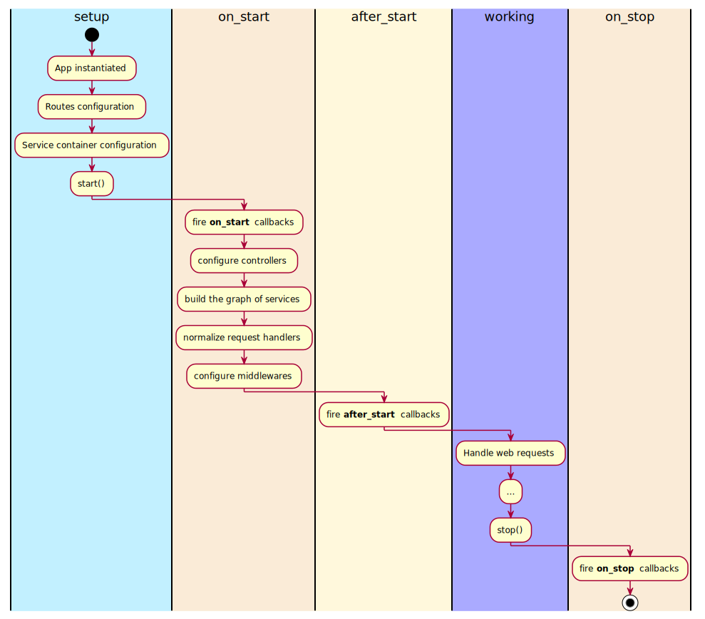

# The Application class
The `Application` class in BlackSheep is responsible of handling the
application life cicle (start, working state, stop), routing, web requests,
exceptions. This page describes details of the `Application` class:

<div class="check-list"></div>
* How to handle errors.
* Application events and life cycle.

## Handling errors

BlackSheep catches any unhandled exception that happens during the execution of
request handlers, producing a `HTTP 500 Internal Server Error` response. To see
this in practice, start an application like the following:

```python
from blacksheep.server import Application

app = Application()
get = app.router.get


@get("/")
def crash_test():
    raise Exception("Crash test")
```

And observe how a request to its root produces a response with HTTP status 500,
and the text "Internal server error".

Exception details are hidden to the client by default: it would be a security
issue if the web application returned error details to the client. However,
while developing and occasionally while investigating issues, it is useful to
be able to obtain error details directly from the web requests that are
failing. To enable error details, update the app declaration as follows:

```python
app = Application(show_error_details=True)
```

Now the application returns the details of the exception with the full stack
trace, serving a page like the following:


Consider using environmental variables to handle this kind of settings that
can vary across environments. For example:

```python
import os
from blacksheep.server import Application

app = Application(show_error_details=bool(os.environ.get("SHOW_ERROR_DETAILS", None)))
get = app.router.get


@get("/")
def crash_test():
    raise Exception("Crash test")

```

> **Note:** BlackSheep project templates use a library to handle application
> settings and configuration roots, named [`roconfiguration`](https://github.com/RobertoPrevato/roconfiguration).

### Configuring exceptions handlers

The BlackSheep `Application` object has a `exception_handlers` dictionary that
defines how errors should be handled. When an exception happens while handling
a web request and reaches the application, the application checks if there is a
matching handler for that kind of exception. An exception handler is defined as
a function with the following signature:

```python
from blacksheep import Request, Response

async def exception_handler(self, request: Request, exc: Exception) -> Response:
    pass
```

In the exception below
```python

class CustomException(Exception):
    pass

async def exception_handler(self, request, exc: CustomException):
    nonlocal app
    assert self is app
    assert isinstance(exc, CustomException)
    return Response(200, content=TextContent('Called'))


# Register the exception handler for the CustomException type:
app.exceptions_handlers[CustomException] = exception_handler


@app.router.get(b'/')
async def home(request):
    # of course, the exception can be risen at any point
    # for example in the business logic layer
    raise CustomException()

```

Exceptions inheriting from `HTTPException` are mapped to handlers by their
status code, using `int` keys; while user defined exceptions are mapped to
handlers by their type.

### Configuring exception handlers using decorators

It is also possible to register exception handlers using decorators, instead
of interacting with `app.exceptions_handlers` dictionary:

```python
class CustomException(Exception):
    pass


@app.exception_handler(CustomException)
async def handler_example(self, request, exc: CustomException):
    ...

```

> 🚀 New in version 1.0.4

---

## Application events

A BlackSheep application exposes three events: **on_start**, **after_start**,
**on_stop**.

### on_start
This event should be used to configure things such as new request handlers,
service registered in `app.services`.

### after_start
This event should be used to configure things that must happen after request
handlers are normalized. At this point, the application router contains information
about actual routes handled by the web application, and routes can be inspected.
For examples, the built-in generation of OpenAPI Documentation generates the
API specification file at this point.

### on_stop
This event should be used to fire callbacks that need to happen when the application
is stopped. For example, disposing of services that require disposal, such as
DB Connection Pools, HTTP Connection Pools.

### Application life cycle

Refer to the following diagram to know more about when application events
are fired, and the state of the application when they are executed.



### Application events example

```python
from blacksheep.server import Application
from blacksheep.server.responses import text
from blacksheep.messages import Request, Response


app = Application()
get = app.router.get


@get("/")
async def home(request: Request) -> Response:
    return text("Example Async")


async def before_start(application: Application) -> None:
    print("Before start")


async def after_start(application: Application) -> None:
    print("After start")


async def on_stop(application: Application) -> None:
    print("On stop")


app.on_start += before_start
app.after_start += after_start
app.on_stop += on_stop
```

### Application events handled using decorators

Since version `1.0.9`, it is also possible to register event handlers using
decorators. The example above rewritten to use decorators looks as follows:

```python
from blacksheep.server import Application
from blacksheep.server.responses import text
from blacksheep.messages import Request, Response


app = Application()
get = app.router.get


@get("/")
async def home(request: Request) -> Response:
    return text("Example Async")


@app.on_start
async def before_start(application: Application) -> None:
    print("Before start")


@app.after_start
async def after_start(application: Application) -> None:
    print("After start")


@app.on_stop
async def on_stop(application: Application) -> None:
    print("On stop")

```

> 🚀 New in version 1.0.9

### Example: after_start callback to log all routes

To define an `after_start` callback that logs all routes registered in the
application router:

```python

async def after_start_print_routes(application: Application) -> None:
    print(application.router.routes)


app.after_start += after_start_print_routes

```

## Next
Read about the details of [routing in BlackSheep](../routing).
